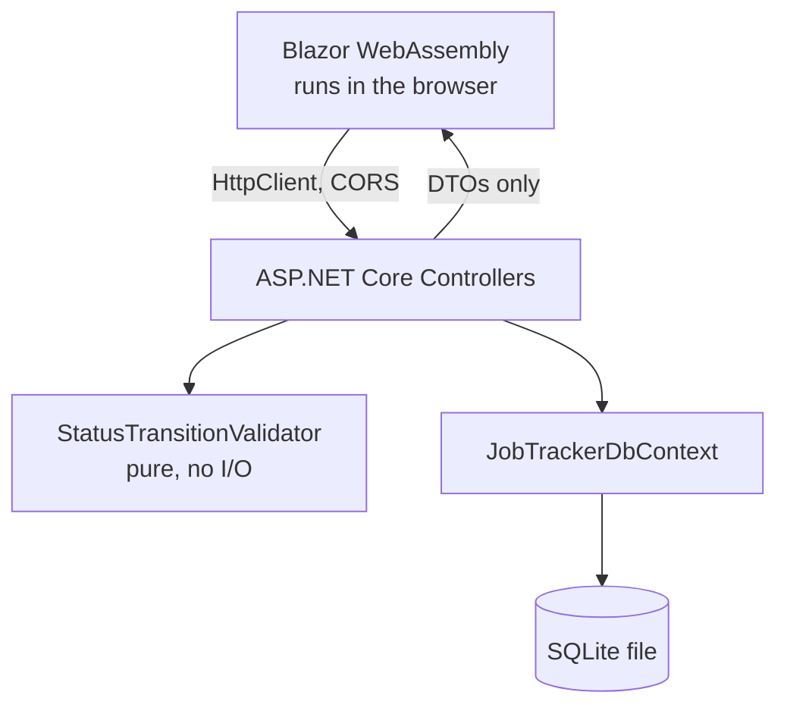

# job-application-tracker

An ASP.NET Core Web API + Entity Framework Core + SQLite backend with a
Blazor WebAssembly frontend, for tracking job applications. SQLite is a
private, zero-cost, file-based database — no server, no account, no API key,
ever.

## Why this exists

A database version of the same thing a spreadsheet does for a job search,
built specifically to demonstrate a C#/.NET stack — EF Core against a real
database, xUnit unit and integration tests, and a Blazor WebAssembly
frontend — none of which this portfolio's other (TypeScript) projects can
show. The five seeded sample applications
(`src/JobApplicationTracker.Domain/Data/SeedData.cs`) use the classic
Microsoft-documentation placeholder company names (Northwind, Contoso,
Fabrikam, Adventure Works, Tailspin) precisely because they read as
unambiguously fictional — this is demo data, not anyone's real job search.

## How it works



Full write-up: [`docs/architecture.md`](./docs/architecture.md) ·
[`docs/ef-core-seeding-design.md`](./docs/ef-core-seeding-design.md)

## The one real business rule

Status can only move forward (`Applied → Interviewing → Offer`, skipping a
stage is fine) or to a terminal state (`Rejected`/`Withdrawn`) at any time —
never backward, never out of a terminal state. The validated endpoint
answers **409 Conflict** for an invalid move; a separate, clearly
de-emphasized "manual correction" endpoint exists for fixing a genuine
mistake, and every correction it makes is flagged in the audit trail. See
[`docs/architecture.md`](./docs/architecture.md#an-explicit-escape-hatch-manual-correction).

## Status

- [x] Session 1 — solution scaffolding, domain model, EF Core + SQLite
      migrations, status-transition business rules, all unit-tested
- [x] Session 2 — Web API (controllers), DTOs, CORS, OpenAPI,
      `WebApplicationFactory` integration tests. Verified live with real
      `curl` requests: 201 with Location on create, 200 on a valid status
      transition, 409 on an invalid one, 204 + 404 on delete
- [x] Session 3 — Blazor WebAssembly frontend calling the real API over CORS.
      Verified live in a browser: seeded list renders, create a new
      application, walk it through status changes, an invalid backward
      transition shows a friendly message (not a crash), delete it again.
      Since extended with a manual status-correction escape hatch, list
      filtering (company/role/status), and a back-to-list button
- [x] Session 4 — docs, CI, GitHub push
- [x] Session 5 — custom dark theme; Swedish/English language selector
      (`Services/LanguageService.cs`, event-based, persisted to
      `localStorage` — sidesteps Blazor WASM's CultureInfo/resx
      satellite-assembly loading). Verified live in a browser: every page,
      the nav, and status labels switch instantly and survive a reload

## Quickstart

```bash
dotnet build
dotnet test                              # 31 tests, fully offline

dotnet run --project src/JobApplicationTracker.Api      # :5097
# in another terminal:
dotnet run --project src/JobApplicationTracker.Client   # :5244, opens in a browser
```

Or without the frontend, talk to the API directly:

```bash
curl http://localhost:5097/api/job-applications
```

## Known limitations

- SQLite is a single-file, single-writer database — the right choice for a
  personal tool, not for concurrent multi-user production use.
- List filtering (`Pages/Applications.razor`) is entirely client-side: it
  fetches the full list once and filters in the browser. Fine at personal
  job-search scale, wouldn't scale to a shared dataset with thousands of
  rows without server-side paging.
- CORS allowed origins are the development ports
  (`src/JobApplicationTracker.Api/appsettings.Development.json`) — a real
  deployment would need its actual origin configured.
- Form validation messages (`Pages/ApplicationForm.razor`'s `FormModel`)
  stay in Swedish regardless of the selected language —
  `DataAnnotations` attribute values must be compile-time constants, so
  making them language-aware would need a custom validator instead of
  `[Required(ErrorMessage = ...)]`.

## License

MIT — see [LICENSE](./LICENSE).
