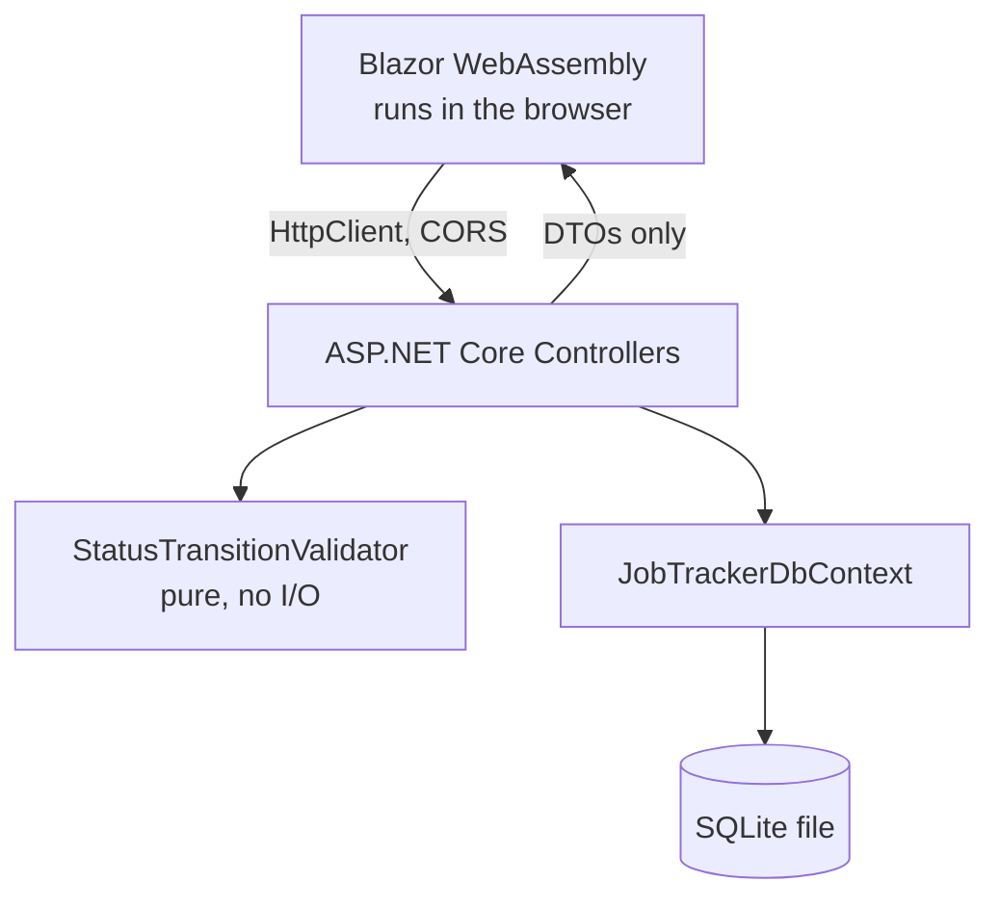

# Architecture

## Request flow



## Five projects, each earning its place

```
JobApplicationTracker.Domain      entities, DbContext, migrations, seed, business rules
JobApplicationTracker.Contracts   DTOs -- zero project references
JobApplicationTracker.Api         controllers, CORS, OpenAPI
JobApplicationTracker.Client      Blazor WebAssembly
JobApplicationTracker.Tests       xUnit: unit + integration
```

`Domain` is a plain class library, not code living inside `Api` -- Session 1
of this project ran `dotnet test` against real business-rule tests before
`Api` even existed. `Contracts` has **zero** project references on purpose:
it's referenced by both `Api` and `Client`, and if it referenced `Domain`,
the Blazor WebAssembly client (code that runs in the visitor's browser)
would drag in `Domain`'s `Microsoft.Data.Sqlite` native dependency along
with it. Status is represented in `JobApplicationDto` as a plain string
(the enum's name, e.g. `"Interviewing"`) for exactly this reason --
`Api`'s controllers do the `Enum.TryParse` at the boundary, so the real
`ApplicationStatus` enum never has to leave `Domain`.

## The one piece of real logic: `StatusTransitionValidator`

Everything else here is CRUD. The one rule worth testing on its own is in
[`src/JobApplicationTracker.Domain/Services/StatusTransitionValidator.cs`](../src/JobApplicationTracker.Domain/Services/StatusTransitionValidator.cs):
`Rejected` and `Withdrawn` are terminal (nothing transitions out of them),
any non-terminal status can move to either of them at any time, and among
`Applied < Interviewing < Offer` only strictly forward moves are valid --
skipping a stage is a normal thing that happens in real hiring processes,
moving backward is not. It's pure C#, no I/O, exercised by a
`[Theory]`/`[InlineData]` table in
[`tests/.../Unit/StatusTransitionValidatorTests.cs`](../tests/JobApplicationTracker.Tests/Unit/StatusTransitionValidatorTests.cs).

The controller's `PATCH .../status` endpoint answers **409 Conflict**, not
400, when this check fails -- the request itself is well-formed (a real
status name), but the resource's current state says no. The Blazor client
treats a 409 here as a normal, expected outcome (see
`JobApplicationApiClient.ChangeStatusAsync`, which returns a
`StatusChangeResult` rather than throwing) and shows a friendly inline
message instead of a stack trace.

## An explicit escape hatch: manual correction

The validated `PATCH .../status` endpoint is deliberately strict -- that's
the point of it. Real usage still needs a way to fix a mistake (the wrong
button was clicked, or a status was recorded wrong), so
`PATCH .../status/correct` exists as a second, separate endpoint that sets
the status directly and skips `StatusTransitionValidator` entirely. Two
things keep it from quietly undermining the validated endpoint's rules:

- Every `StatusChange` row this endpoint creates is flagged
  `IsCorrection = true` (see the
  `20260910071215_AddIsCorrectionToStatusChange` migration), so the audit
  trail always shows which changes bypassed the rules and which didn't --
  the Blazor UI renders these with a distinct "manuell korrigering" badge in
  the timeline.
- In the UI it sits behind a deliberately de-emphasized, collapsed link
  ("Behöver du korrigera manuellt?") below the normal status buttons, not a
  button of equal visual weight -- see
  `src/JobApplicationTracker.Client/Pages/ApplicationDetail.razor`.

## CORS is a named policy, not `AllowAnyOrigin`

This project needs CORS specifically because the frontend is Blazor
**WebAssembly** -- it runs in the visitor's browser and makes real
cross-origin HTTP calls to the API, unlike Blazor Server (which renders
server-side and needs no CORS at all). The allowed origins
(`http://localhost:5244`, `https://localhost:7288` in development) come from
`Api`'s configuration, not a wildcard -- see
`src/JobApplicationTracker.Api/appsettings.Development.json`.

## Testing strategy

Unit tests hit `StatusTransitionValidator` directly: pure, synchronous, no
setup. Integration tests use `WebApplicationFactory<Program>` against the
real ASP.NET Core pipeline -- the same idea as the ephemeral-port Express
tests in this portfolio's TypeScript siblings, just the .NET equivalent. Two
non-obvious things had to be handled correctly for that to work at all:

- `Program.cs` uses top-level statements, which the compiler makes
  `internal` by default -- invisible to the separate test assembly. A single
  `public partial class Program { }` line at the bottom of `Program.cs` is
  the fix.
- SQLite's `:memory:` database is destroyed the instant its last open
  connection closes, and EF Core opens and closes a connection per
  operation by default. `CustomWebApplicationFactory` works around this by
  opening one `SqliteConnection` and keeping it open for the whole test
  fixture's lifetime, then passing that live connection object (not a
  connection string) to `UseSqlite`.

See
[`tests/JobApplicationTracker.Tests/Integration/CustomWebApplicationFactory.cs`](../tests/JobApplicationTracker.Tests/Integration/CustomWebApplicationFactory.cs).

## No API keys, anywhere

SQLite is an embedded file-based database -- no server to run, no account to
create, no key to put in `.env`. Unlike this portfolio's other projects,
there's also no live external dependency to check in CI: the entire stack
(API, database, frontend) runs locally, so `dotnet test` already exercises
the real thing end to end.
